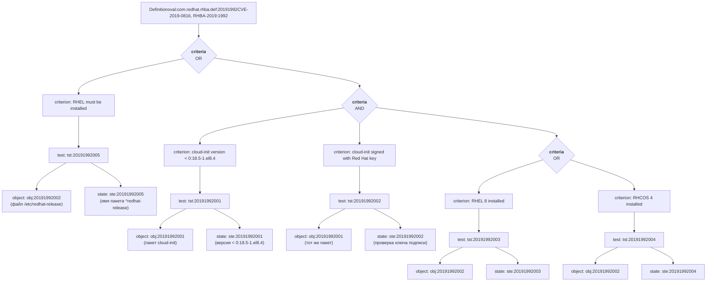

Целевой файл: rhel-8.oval.xml
## Часть 1. Структурный анализ
_______
### Основные типы XML-элементов:
- **definition** - элемент, указывающий класс, идентификационный номер
- **tests** - элемент, содержащий описание проверки объектов системы
- objects - элемент, указывающий ссылку на проверяемый объект
- states - элемент, указывающих на проверяемое состояние для сравнения
### Пример из файла: 
definition - id="oval:com.redhat.rhba:def:20191992", class="patch"
tests:
Тест первый tst:20191992005 - comment="Red Hat Enterprise Linux must be installed"
 Объект: `/etc/redhat-release`
 Состояние: `^redhat-release`

### Цепочка зависимостей в виде схемы для уязвимости (патча)
definition - id="oval:com.redhat.rhba:def:20191992", class="patch"
Критерий: criterion comment="cloud-init is earlier than 0:18.5-1.el8.4"
test: test_ref="oval:com.redhat.rhba:tst:20191992001"
Ссылка на объект: object_ref="oval:com.redhat.rhba:obj:20191992001"
Ссылка на состояние: state_ref="oval:com.redhat.rhba:ste:20191992001"
Объект: cloud-init
Состояние: 0:18.5-1.el8.4

## Схема 

## Часть 2. Критический анализ проверок
_____
