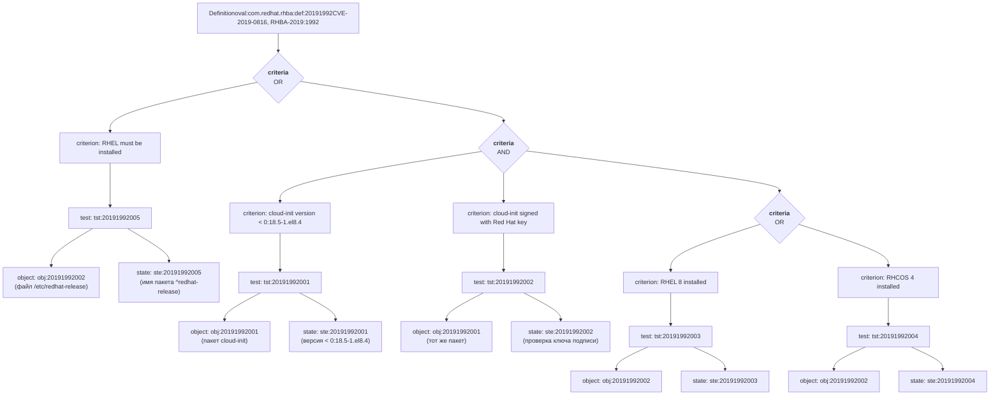

Целевой файл: rhel-8.oval.xml
## Часть 1. Структурный анализ
_______
### Основные типы XML-элементов:
- **definition** - элемент, указывающий класс, идентификационный номер
- **tests** - элемент, содержащий описание проверки объектов системы
- objects - элемент, указывающий ссылку на проверяемый объект
- states - элемент, указывающих на проверяемое состояние для сравнения
### Пример из файла: 
definition - id="oval:com.redhat.rhba:def:20191992", class="patch"
tests:
Тест первый tst:20191992005 - comment="Red Hat Enterprise Linux must be installed"
 Объект: `/etc/redhat-release`
 Состояние: `^redhat-release`

### Цепочка зависимостей в виде схемы для уязвимости (патча)
definition - id="oval:com.redhat.rhba:def:20191992", class="patch"
Критерий: criterion comment="cloud-init is earlier than 0:18.5-1.el8.4"
test: test_ref="oval:com.redhat.rhba:tst:20191992001"
Ссылка на объект: object_ref="oval:com.redhat.rhba:obj:20191992001"
Ссылка на состояние: state_ref="oval:com.redhat.rhba:ste:20191992001"
Объект: cloud-init
Состояние: 0:18.5-1.el8.4

## Схема 

## Часть 2. Критический анализ проверок
_____

### Патч №1 - oval:com.redhat.rhba:def:20191992 RHBA-2019:1992: cloud-init bug fix and enhancement update (Moderate)
1. Минимально достаточные:
	- tst:20191992001 - минимально необходимая для определения, что пакет уязвим
	- tst:20191992003 или tst:20191992004 - минимально достаточно чтобы определить платформу
2. Избыточные:
	- tst:20191992002 - наличие/отсутствие подписи не говорит об установленной версии
	- tst:20191992005 - Избыточен, так как есть проверки tst:20191992003 и tst:20191992004
3. Ложноположительные / ложноотрицательные проверки:
	- tst:20191992005 - атрибут `check="none satisfy"` возвращает логическое "True" если пакета redhat-release нет, поэтому системны отличные от RedHat будут отображать уязвимость в пакете cloud-init, хотя его может не быть.
	- tst:20191992002 - подпись может быть изменена при пересборках, но сам пакет при этом может быть уязвимой версии и не будет помечен как уязвимый;
	- tst:20191992003 и tst:20191992004 - на других RHEL-дистрибутивах файлы платформы могут называться иначе и проверка не пройдет

### Патч №2 - oval:com.redhat.rhba:def:20193408 RHBA-2019:3408: openjpeg2 bug fix and enhancement update (Low)
1. Минимально достаточные наборы проверок
- tst:20193408001 - проверить что версия openjpeg2 ниже 0:2.3.1-1.el8
- tst:20191992003 или tst:20191992004 - проверить платформу
2. Избыточные:
- tst:20193408003 - Проверять подпакет openjpeg2-devel избыточно 
- tst:20193408005 - Проверять подпакет openjpeg2-devel-docs избыточно
- tst:20193408007 - Проверять подпакет openjpeg2-tools избыточно
- tst:20191992005 - Избыточно, так как достаточно tst:20191992003 или tst:20191992004
- tst:20193408002, tst:20193408004, tst:20193408006, tst:20193408008 - Подпись не помогает определить пакет
1. Ложноположительные / ложноотрицательные проверки:
-  tst:20191992005 - атрибут `check="none satisfy"` возвращает логическое "True" если пакета redhat-release нет, поэтому системны отличные от RedHat будут отображать уязвимость в пакете cloud-init, хотя его может не быть.
- tst:20193408002, tst:20193408004, tst:20193408006, tst:20193408008 - подпись может быть изменена при пересборках, но сам пакет при этом может быть уязвимой версии и не будет помечен как уязвимый;
- tst:20191992003 и tst:20191992004 - на других RHEL-дистрибутивах файлы платформы могут называться иначе и проверка не пройдет

### Патч №3 - oval:com.redhat.rhba:def:20193621 RHBA-2019:3621: libidn2 bug fix and enhancement update (Moderate)
1. Минимально достаточные наборы проверок:
- tst:20193621001 - Проверить пакет idn2 ниже версии 0:2.2.0-1.el8
- tst:20191992003 или tst:20191992004 - проверить платформу
1. Избыточные:
- tst:20193621003 - подпакет libidn2 проверять избыточно
- tst:20193621005 - подпакет libidn2-devel проверять избыточно
- tst:20193621002, tst:20193621004, tst:20193621006 - подпись не помогает определить пакет
1. Ложноположительные / ложноотрицательные проверки:
- tst:20191992005 - атрибут `check="none satisfy"` возвращает логическое "True" если пакета redhat-release нет, поэтому системны отличные от RedHat будут отображать уязвимость в пакете cloud-init, хотя его может не быть.
- tst:20193621002, tst:20193621004, tst:20193621006 - подпись может быть изменена при пересборках, но сам пакет при этом может быть уязвимой версии и не будет помечен как уязвимый
- tst:20191992003 и tst:20191992004 - на других RHEL-дистрибутивах файлы платформы могут называться иначе и проверка не пройдет

## Часть 3. Упрощение формата
_____
Предварительно:
Метаданные, Ссылки типа reference, лист CPE 

## Часть 4. Автоматизация
______
